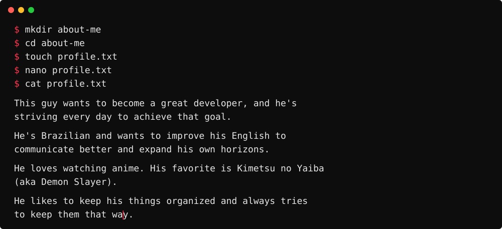
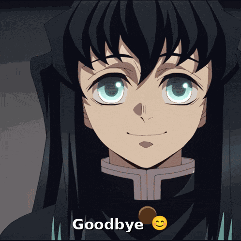

<!L BANNER ZONE>

<div align="center">
    
</div>

<!RAPHAEL.NC GLITCH STYLE ZONE>

<div align="center">
    
</div>

<!JAVA CODE RaphaelNC ZONE>

```java
public final class RaphaelNC {
    private static final String CURRENTLY_STUDYING = "Information Systems";

    private static final String FACULTY = "Instituto Federal do Espírito Santo ( IFES ) - Brazil";

    private static final String ROLE = "Aspiring Backend Developer";

    private static final String FAVORITE_LANGUAGE = "Java ☕";

    private static final String[] LEARNING = {
        "Java",
        "OOP",
        "Algorithms",
        "Git & GitHub",
        "Linux"
    };

    public static void main( String[] args ) {
        System.out.println( "Learn. Build. Break. Fix. Repeat." );
        System.out.print( "\n" );
        System.out.println( "♡ JAVA IS MY BELOVED (˶>⩊<˶) ♡" );
    }

}
```

<!TERMINAL ABOUT ME ZONE>

<br>

<p align="center">
  
</p>

<!CONNECT WITH ME ZONE>

<br>

<div align="center">
  <a href="https://git.io/typing-svg">
    
  </a>
</div>

<p align="center">
  <a href="https://github.com/raphaelncscholar"></a>
  <a href="https://mail.google.com/mail/?view=cm&fs=1&to=raphaelncarvalho.contato%40gmail.com"></a>
  <a href="https://leetcode.com/u/RNCDev/"></a>
</p>

<br>

<!MY STACKS ZONE>

<div align="center">
  <br>
  
  <br>
</div>

<p align="center">
  
  
  
  
</p>

<!GITHUB STATS & TO LANGS ZONE>

<br>
<br>

<div align="center">
  
  <br>
  
  <br>
  
</div>

<div align="center">
 
</div>

<!FINAL INFOS ZONE>


<!BYE BYE ZONE>
<br>
<br>
<br>
<br>
<br>
<br>

<p align="left">
  
</p>

<!CONTRIBUTION SNAKE ZONE>

<picture>
  <source media="(prefers-color-scheme: dark)" srcset="https://raw.githubusercontent.com/raphaelncarvalho/raphaelncarvalho/output/github-snake-dark.svg">
  <source media="(prefers-color-scheme: light)" srcset="https://raw.githubusercontent.com/raphaelncarvalho/raphaelncarvalho/output/github-snake.svg">
  
</picture>
